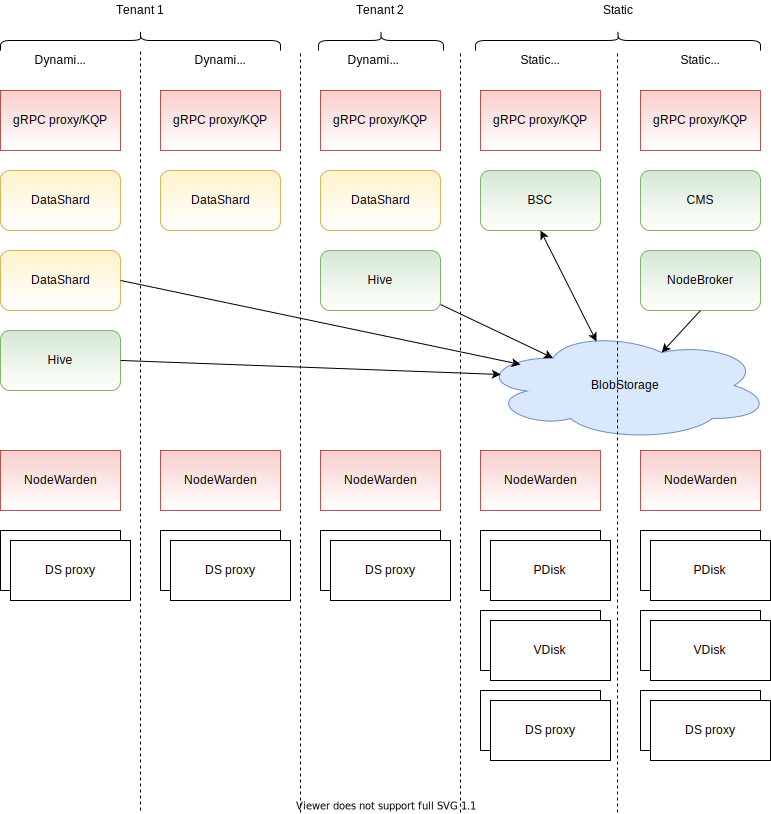
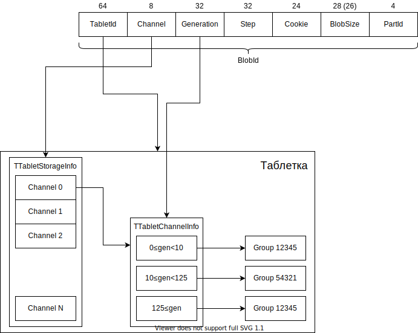

# Общая схема {{ ydb-short-name }}

Примерная общая схема {{ ydb-short-name }} представлена ниже.

## Узлы {#nodes}

Одна инсталляция {{ ydb-short-name }} состоит из *кластера*, который разбит на *узлы*. Узел — это один процесс в системе, как правило, ydbd. Этот узел входит в кластер и может обмениваться данными с другими узлами в этом кластере через *Interconnect*. Каждый *узел* имеет свой идентификатор, который обычно называется NodeId. NodeId — целое число от 1, состоящее из 20 бит. NodeId 0 зарезервирован для внутренних нужд и, как правило, обозначает текущий узел либо отсутствие узла.

На каждом узле выполняется ряд сервисов, реализованных через *акторы*.

Узлы могут быть статическими или динамическими.

Конфигурация статических узлов, то есть их полный перечень с указанием адресов для подключения по Interconnect, хранится в конфигурационном файле и вычитывается единожды при запуске процесса. Набор статических узлов меняется очень редко. Как правило, это происходит при расширении кластеров или при переезде узлов с одних физических машин на другие. Для того чтобы изменить набор статических узлов, необходимо разложить на **всех** узлах обновлённую конфигурацию, после чего выполнить rolling restart всего кластера.

Динамические узлы заранее неизвестны и добавляются в систему по мере запуска новых процессов. Это может быть связано, например, с созданием новых тенантов в инсталляциях {{ ydb-short-name }} как базы данных. При регистрации динамического узла его процесс сначала подключается к одному из статических узлов через gRPC и через специальный сервис, который называется Node Broker, передаёт информацию о себе, получая в ответ NodeId, под которым ему можно будет войти в систему. Механизм назначения узлов во многом похож на DHCP в контексте раздачи IP-адресов.

## Таблетки {#tablets}

На каждом узле выполняются специальные микросервисы, которые называются [таблетками](../concepts/glossary.md#tablet). Каждая таблетка имеет определённый тип и идентификатор и является singleton'ом, что означает, что в каждый момент времени во всём кластере может работать только одна таблетка с конкретным идентификатором. Таблетка может запускаться на любом из подходящих для неё узлов. Важной характеристикой таблетки является её поколение — [Generation](../concepts/glossary.md#tablet-generation) — которое увеличивается при каждом следующем запуске. Стоит отметить, что в силу распределённости системы и наличия различного рода проблем, например, сетевого партиционирования, может сложиться ситуация, когда одна и та же таблетка будет фактически выполняться на двух разных узлах одновременно. Однако distributed storage гарантирует, что только одна из них сможет успешно завершить операции, изменяющие её состояние, и при этом поколение, в котором выполнена каждая успешная операция, не будет убывать со временем.

Для [системных таблеток](../concepts/glossary.md#tablet-types) кластера узел, на котором запускается таблетка, выбирается с помощью механизма Bootstrapper, реализующего [распределённый консенсус](https://ru.wikipedia.org/wiki/%D0%9A%D0%BE%D0%BD%D1%81%D0%B5%D0%BD%D1%81%D1%83%D1%81_%D0%B2_%D1%80%D0%B0%D1%81%D0%BF%D1%80%D0%B5%D0%B4%D0%B5%D0%BB%D1%91%D0%BD%D0%BD%D1%8B%D1%85_%D0%B2%D1%8B%D1%87%D0%B8%D1%81%D0%BB%D0%B5%D0%BD%D0%B8%D1%8F%D1%85). Пользовательскими таблетками управляет специальная таблетка [Hive](hive.md). Hive следит за тем, что акутальное поколение каждой таблетки запущено ровно на одном узле, распределяет таблетки между узлами и [каналы](../concepts/glossary.md#channel) таблеток между группами хранения.

Узнать, на каком узле выполняется таблетка в актуальном поколении, можно через сервис *StateStorage*. Для отправки сообщений в таблетку существует специальный набор библиотек, который называется *tablet pipe*. С его помощью, зная идентификатор целевой таблетки, можно легко послать ей нужное сообщение.

Таблетку можно условно разделить на две части: базовая таблетка и пользовательская логика.

Базовая таблетка представляет собой набор таблиц, каждая из которых может состоять из одной или нескольких колонок ключа произвольного типа, а также произвольного набора колонок данных. Каждая таблица может иметь свою схему, кроме того, таблицы можно создавать и удалять в ходе работы таблетки. Интерфейс базовой таблетки позволяет выполнять операции чтения и изменения этих таблиц.

Пользовательская логика находится между базовой таблеткой и пользователем и позволяет обрабатывать специфические запросы для данного типа таблеток, надёжно сохраняя изменения в distributed storage. Часто используемый шаблон работы таблетки — хранение всех данных в памяти, их вычитка только на старте и синхронное изменение данных в памяти и в хранилище после успешного коммита.

### Как таблетка хранит данные и какие они {#storage}

Базовая таблетка представляет собой LSM-дерево, в котором находятся все данные её таблицы. Уровнем ниже базовой таблетки находится distributed storage, который, грубо говоря, является KeyValue-хранилищем, в котором лежат блобы. *Блоб* — это бинарный фрагмент размером от 1 байта до 10 мегабайт, который имеет идентификатор фиксированной структуры (обычно он называется *BlobId* и имеет тип TLogoBlobID) и связанные с ним данные. Хранилище иммутабельно, то есть каждому идентификатору соответствует только одно значение, которое не может изменяться со временем. Блоб можно записать, прочитать и затем удалить, когда он станет не нужен.

Подробнее о блобах и распределённом хранилище можно прочитать в разделе [{#T}](distributed-storage.md).

Для distributed storage блобы являются непрозрачной сущностью. Таблетка может хранить несколько типов блобов. Наиболее часто записываемый блоб — блоб лога (имеется в виду recovery log, журнал восстановления). Лог таблетки устроен в виде списка блобов, в каждом из которых содержится информация о вносимом изменении в таблицы. При запуске таблетка находит последний блоб лога и затем рекурсивно по ссылкам вычитывает все связанные с ним блобы. В логе могут также содержаться ссылки на блобы снапшотов, которые содержат данные нескольких блобов лога после слияния (операция merge в LSM-дереве).

Блобы разных типов таблетка записывает в разные *каналы*. Канал указывает ветвь хранилища, в которой следует хранить блобы, и выполняет несколько функций, а именно:

1. Выбор типа хранилища (разные каналы могут быть привязаны к разным типам устройств — SSD, HDD, NVMe).
2. Балансировка нагрузки, так как каждый канал имеет лимит по IOPS, доступному месту и пропускной способности.
3. Указание типа данных. При восстановлении лога читаются только блобы из нулевого канала, что позволяет отделить их от прочих блобов.

### История каналов в таблетке {#history}

Как уже говорилось, каждая группа имеет фиксированный объём данных, которые в неё могут помещаться, а также делит полосу пропускания и число операций в секунду между всеми потребителями. Нагрузка на таблетки может меняться, и в результате может сложиться так, что группа станет перегруженной и возникнет необходимость использовать для записи другую группу. Для этого вводится понятие истории, которое позволяет для каждой таблетки, зная Channel и Generation блоба, определить, в какую группу записан данный блоб.

Иллюстрация работы этого механизма приведена ниже:

Для каждого канала в структуре TTabletStorageInfo содержится подструктура TTabletChannelInfo, которая содержит диапазоны поколений и номер группы, соответствующий каждому диапазону. Диапазоны строго примыкают друг к другу, последний диапазон открыт. Номера групп могут пересекаться в разных диапазонах и даже между разными каналами — это не запрещено и достаточно часто встречается.

При выполнении записи блоба таблетка выбирает самый последний диапазон для соответствующего канала, так как запись всегда идёт от имени текущего поколения таблетки. При выполнении чтения номер группы извлекается исходя из BlobId.Generation читаемого блоба.
